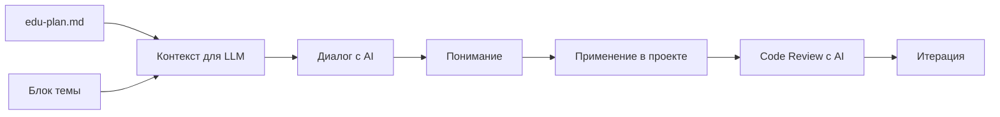
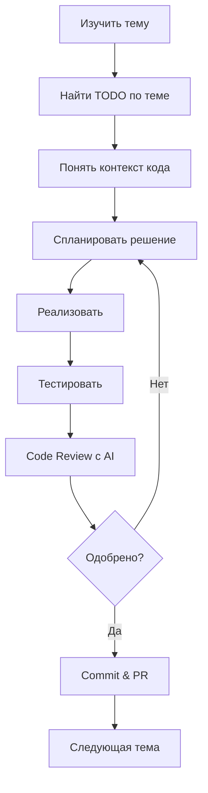
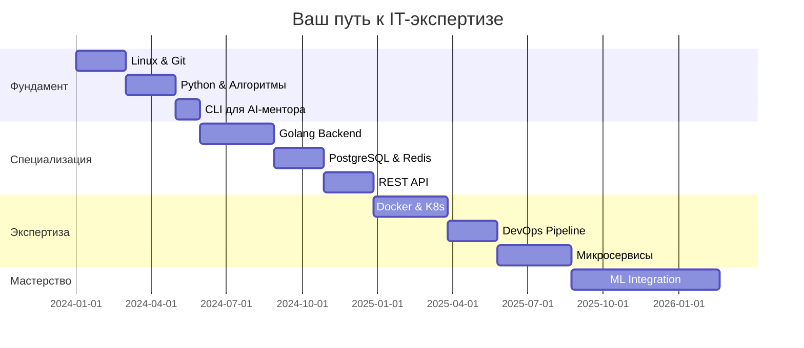

# 🚀 От нуля до AI-ментора: Полный путь Backend-разработчика

*Изучаем программирование и backend-разработку через создание реального AI-ментора*

---

## Параллельно с лучшим курсом на планете: [Stepik.org "Поколение Python": курс для начинающих](https://stepik.org/course/58852/promo)

---

## Смотрите так же: [Мои другие проекты](https://github.com/mmdev2003?tab=repositories)

---

## 📞 Телеграм: @gommgo

---

## 🎯 Введение: Ваш путь к мастерству

Добро пожаловать в революционную программу обучения, где вы не просто изучаете технологии — вы строите своего собственного AI-ментора, применяя все полученные знания в реальном проекте.

### 🔥 Уникальность подхода

```
Традиционное обучение          Наш подход
━━━━━━━━━━━━━━━━━━━━          ━━━━━━━━━━━━━━━━━━━━━━━━━━━━
📚 Теория → Упражнения    →    🛠️ Реальный проект с первого дня
👨‍🏫 Преподаватель         →    🤖 AI-ментор + Реальный код
📝 Тесты и экзамены       →    💼 Работающий продукт в портфолио
❌ Забывается через месяц →    ✅ Навыки закреплены в коде
```

### 🎭 Двойная роль: Студент и Разработчик

В этом курсе вы одновременно:
1. **Студент** — изучаете технологии через структурированную программу
2. **Разработчик** — дорабатываете реальный AI-ментор, применяя изученное

Ваша финальная цель: **довести до production-ready состояния AI-ментора**, который поможет следующему поколению студентов.

---

## 🏗️ Архитектура курса

### 📊 Структура обучающих материалов

```
IT-Курс/
│
├── 📁 Темы (30+ тем)
│   ├── 📄 edu-plan.md      # План изучения темы
│   ├── 📄 intro.md          # Введение и контекст
│   │
│   └── 📁 Блоки (5-7 блоков на тему)
│       ├── 📄 Описание блока
│       │
│       └── 📁 Главы (3-5 глав на блок)
│           ├── 📄 Теория
│           ├── 📄 Практика
│           └── 📄 Задания
│
└── 🤖 AI-Mentor-Project/
    ├── 📁 backend/          # Ваш проект для доработки
    ├── 📁 frontend/         # Применение изученного
    └── 📄 TODO.md           # Что нужно доделать
```

### 🗺️ Навигация по темам

| Этап | Темы | Применение в AI-менторе |
|------|------|-------------------------|
| **Фундамент** (1-6 мес) | Linux, Python, Git, Алгоритмы | Базовая структура, CLI интерфейс |
| **Специализация** (7-18 мес) | Golang, PostgreSQL, Redis, API | Backend сервисы, БД, кэширование |
| **Экспертиза** (19-30 мес) | Docker, K8s, DevOps, Monitoring | Контейнеризация, деплой, метрики |
| **Мастерство** (31-36 мес) | ML/AI, Architecture | Интеграция ML моделей |

---

## 🤖 Методология обучения с LLM

### 🧠 Концепция "AI-Powered Learning"

Вместо традиционных лекций вы используете Large Language Models (LLM) как персонального преподавателя, следуя структурированному подходу:



### 📋 Пошаговый алгоритм изучения темы

#### Шаг 1: Подготовка контекста для LLM

```markdown
# Промпт-шаблон для начала изучения темы

Я изучаю тему: [НАЗВАНИЕ ТЕМЫ]
Мой текущий уровень: [начинающий/средний/продвинутый]

Вот план изучения (edu-plan.md):
[ВСТАВИТЬ СОДЕРЖИМОЕ edu-plan.md]

Текущий блок для изучения:
[ВСТАВИТЬ ОПИСАНИЕ БЛОКА]

Моя цель: понять эту тему и применить её в проекте AI-ментора.

Пожалуйста:
1. Объясни ключевые концепции простым языком
2. Приведи практические примеры
3. Покажи, как это применяется в реальных проектах
4. Дай задания для закрепления
```

#### Шаг 2: Интерактивное обучение

**🎯 Техника "Объясни как пятилетнему" (ELI5)**
```markdown
"Объясни [концепцию] так, как будто мне 5 лет, 
затем постепенно усложняй до профессионального уровня"
```

**🔄 Техника "Сократический диалог"**
```markdown
"Не давай мне готовые ответы. Задавай наводящие вопросы, 
чтобы я сам пришел к пониманию [темы]"
```

**🛠️ Техника "Покажи на примере"**
```markdown
"Покажи 3 примера кода: 
1. Плохой (антипаттерн)
2. Нормальный (работает, но не идеально)
3. Отличный (best practices)
Объясни разницу"
```

#### Шаг 3: Применение в AI-менторе

```markdown
# Промпт для интеграции знаний в проект

Я изучил: [ТЕМА]
Ключевые концепции, которые я понял: [ПЕРЕЧИСЛИТЬ]

В проекте AI-ментора есть модуль: [НАЗВАНИЕ МОДУЛЯ]
Текущий код: [ВСТАВИТЬ ФРАГМЕНТ]

Как я могу улучшить этот код, используя изученные концепции?
Предложи рефакторинг с объяснением каждого изменения.
```

### 🎓 Продвинутые техники работы с LLM

#### 1. **Метод Фейнмана через AI**
```markdown
"Я попробую объяснить тебе [тему] своими словами. 
Укажи на ошибки и неточности в моем понимании:
[ВАШЕ ОБЪЯСНЕНИЕ]"
```

#### 2. **Генерация тестовых заданий**
```markdown
"Создай 5 практических заданий по теме [ТЕМА] 
с возрастающей сложностью. Для каждого дай:
- Описание задачи
- Входные/выходные данные
- Подсказки (скрытые по умолчанию)
- Эталонное решение"
```

#### 3. **Code Review с AI**
```markdown
"Проведи code review моего решения:
[ВАШ КОД]

Оцени по критериям:
- Корректность
- Производительность
- Читаемость
- Соответствие best practices
- Безопасность

Дай конкретные предложения по улучшению."
```

#### 4. **Debugging с AI**
```markdown
"Мой код не работает как ожидалось:
[КОД]

Ожидаемое поведение: [ОПИСАНИЕ]
Актуальное поведение: [ОПИСАНИЕ]
Ошибка: [ТЕКСТ ОШИБКИ]

Помоги найти проблему, задавая наводящие вопросы,
не давай готовое решение сразу."
```

---

## 💻 Работа с проектом AI-ментора

### 🎯 Философия "Learning by Fixing"

Вам предоставляется **незавершенный, но рабочий** AI-ментор с:
- ✅ Правильной архитектурой
- ✅ Примерами всех паттернов
- ❌ Недописанными модулями
- ❌ TODO комментариями
- ❌ Заглушками (stubs)

### 📝 Структура TODO в проекте

```go
// TODO: [УРОВЕНЬ] - [ТЕМА] - [ОПИСАНИЕ]
// Уровни:
// JUNIOR - можно сделать после 1-6 месяцев
// MIDDLE - требует знаний 7-18 месяцев  
// SENIOR - необходимы знания 19-30 месяцев
// EXPERT - финальные улучшения 31-36 месяцев

// Пример:
// TODO: MIDDLE - PostgreSQL - Implement caching layer with Redis
func GetUserProgress(userID string) (*Progress, error) {
    // Текущая реализация - прямой запрос к БД
    return db.GetProgress(userID)
    // Нужно добавить Redis кэширование
}
```

### 🔄 Цикл разработки



### 🏗️ Прогрессивное улучшение проекта

| Месяц | Что вы добавите в AI-ментор | Результат |
|-------|------------------------------|-----------|
| 1-3 | CLI интерфейс, базовые команды | Работающий консольный ментор |
| 4-6 | Структуры данных для хранения прогресса | Персистентность данных |
| 7-9 | REST API на Golang | Web-доступ к ментору |
| 10-12 | PostgreSQL интеграция | Полноценная БД |
| 13-15 | Аутентификация и авторизация | Многопользовательская система |
| 16-18 | Redis кэширование | Оптимизация производительности |
| 19-21 | Docker контейнеризация | Портативность |
| 22-24 | Kubernetes деплой | Масштабируемость |
| 25-27 | Микросервисная архитектура | Модульность |
| 28-30 | Мониторинг и метрики | Observability |
| 31-36 | ML модели для персонализации | AI-driven обучение |

---

## 📚 Практическое руководство по каждому этапу

### 🌱 Этап 1: Фундамент (Месяцы 1-6)

#### Неделя типичного обучения

**День 1-2: Теория с LLM**
```markdown
Утренняя сессия (2 часа):
1. Загрузить edu-plan.md темы в LLM
2. Изучить первый блок через диалог
3. Делать заметки в Obsidian/Notion

Вечерняя сессия (2 часа):
1. Практические упражнения с LLM
2. Решение задач с подсказками
3. Проверка понимания через объяснение
```

**День 3-4: Применение в проекте**
```markdown
1. Найти TODO метки уровня JUNIOR
2. Изучить окружающий код
3. Спросить LLM: "Объясни архитектуру этого модуля"
4. Реализовать улучшение
5. Провести code review с AI
```

**День 5: Интеграция и тестирование**
```markdown
1. Написать тесты для нового кода
2. Интегрировать с существующей системой
3. Документировать изменения
4. Создать Pull Request с описанием
```

**Выходные: Ревью и планирование**
```markdown
1. Просмотреть изученное за неделю
2. Заполнить пробелы в понимании
3. Запланировать следующую неделю
4. Обновить roadmap прогресса
```

### ⚡ Этап 2: Специализация (Месяцы 7-18)

#### Работа с реальным backend кодом

**Пример промпта для изучения Golang в контексте проекта:**
```markdown
В проекте AI-ментора есть файл handlers/api.go:
[КОД ФАЙЛА]

Я изучаю Golang. Объясни:
1. Какие паттерны Go здесь используются?
2. Что можно улучшить с точки зрения idiomatic Go?
3. Где здесь можно применить goroutines?
4. Как добавить graceful shutdown?
```

**Задания для закрепления:**
- Добавить middleware для логирования
- Реализовать rate limiting
- Добавить метрики Prometheus
- Написать интеграционные тесты

### 🚀 Этап 3: Экспертиза (Месяцы 19-30)

#### DevOps и инфраструктура

**Dockerfile для AI-ментора:**
```dockerfile
# TODO: SENIOR - Docker - Оптимизировать multi-stage build
FROM golang:1.21 AS builder
WORKDIR /app
COPY . .
RUN go build -o mentor cmd/main.go

FROM alpine:latest
# TODO: Добавить health checks
# TODO: Настроить security
COPY --from=builder /app/mentor /mentor
CMD ["/mentor"]
```

**Задания:**
1. Оптимизировать размер образа
2. Добавить health checks
3. Настроить security scanning
4. Создать docker-compose для локальной разработки
5. Настроить CI/CD pipeline

---

## 🎮 Геймификация обучения

### 🏆 Система достижений

```markdown
🥉 Bronze Developer (1-6 мес)
├── First Commit: Первый PR в проект
├── Bug Hunter: Найдено и исправлено 5 багов
└── CLI Master: Полностью реализован CLI

🥈 Silver Engineer (7-18 мес)
├── API Builder: Создано 10+ endpoints
├── Database Guru: Оптимизировано 20+ запросов
└── Cache Lord: Снижено время отклика на 50%

🥇 Gold Architect (19-30 мес)
├── Container Captain: Проект в Kubernetes
├── DevOps Hero: Полный CI/CD pipeline
└── Monitoring Master: 99.9% uptime

💎 Diamond Expert (31-36 мес)
├── ML Integration: Внедрены ML модели
├── Open Source Contributor: 50+ stars на GitHub
└── Mentor: Помог 10+ новичкам
```

### 📊 Метрики прогресса

```python
class Progress:
    def __init__(self):
        self.topics_completed = 0
        self.code_lines_written = 0
        self.bugs_fixed = 0
        self.features_implemented = 0
        self.tests_written = 0
        self.documentation_pages = 0
        self.mentoring_hours = 0
    
    def calculate_level(self):
        # Ваш уровень растет с каждым достижением
        return (self.topics_completed * 10 + 
                self.code_lines_written / 100 +
                self.bugs_fixed * 5 +
                self.features_implemented * 20 +
                self.tests_written * 3 +
                self.documentation_pages * 2 +
                self.mentoring_hours * 5)
```

---

## 🛠️ Инструменты и настройка окружения

### 💻 Необходимый софт

```bash
# Базовое окружение
git --version                    # Контроль версий
docker --version                  # Контейнеризация
code --version                   # VS Code

# Языки программирования
python --version                  # Python 3.9+
go version                       # Go 1.21+
node --version                   # Node.js 18+

# Базы данных
psql --version                   # PostgreSQL 15+
redis-server --version           # Redis 7+

# Инструменты
kubectl version                  # Kubernetes CLI
terraform --version              # Infrastructure as Code
ansible --version                # Configuration Management
```

### 🔧 Настройка VS Code

```json
// settings.json для продуктивной работы
{
    "editor.fontSize": 14,
    "editor.minimap.enabled": false,
    "editor.formatOnSave": true,
    "editor.rulers": [80, 120],
    
    // Расширения must-have
    "recommendations": [
        "ms-python.python",
        "golang.go",
        "ms-azuretools.vscode-docker",
        "ms-kubernetes-tools.vscode-kubernetes-tools",
        "GitHub.copilot",
        "eamodio.gitlens"
    ]
}
```

### 🤖 Настройка AI-помощников

**GitHub Copilot**
- Используйте для автодополнения кода
- Учитесь писать хорошие комментарии для генерации

**ChatGPT/Claude**
- Основной инструмент обучения
- Code review и debugging
- Архитектурные решения

**Cursor/Continue**
- IDE с встроенным AI
- Контекстное понимание проекта

---

## 📈 Дорожная карта успеха

### 🗓️ Помесячный план действий



### 🎯 Контрольные точки

| Месяц | Milestone | Критерии успеха |
|-------|-----------|-----------------|
| 3 | MVP AI-ментора | Работающий CLI с базовыми командами |
| 6 | Junior Ready | Готовность к первой работе |
| 12 | Full Backend | API + БД + Кэш полностью работают |
| 18 | Production Ready | Система готова к реальным пользователям |
| 24 | DevOps Complete | Автоматизированный деплой и мониторинг |
| 30 | Architecture Master | Микросервисы и высокая нагрузка |
| 36 | AI Expert | ML модели интегрированы и работают |

---

## 🆘 Решение проблем

### ❌ Частые ошибки и как их избежать

**1. Попытка изучить всё сразу**
```
❌ Неправильно: Прыгать между темами
✅ Правильно: Следовать последовательному плану
```

**2. Только теория без практики**
```
❌ Неправильно: Читать documentation весь день
✅ Правильно: 20% теория, 80% код
```

**3. Копирование без понимания**
```
❌ Неправильно: Ctrl+C/Ctrl+V из StackOverflow
✅ Правильно: Понять, адаптировать, улучшить
```

**4. Игнорирование code review**
```
❌ Неправильно: Merge без проверки
✅ Правильно: AI review → Self review → Peer review
```

### 🔥 Когда становится сложно

**Синдром самозванца (Месяцы 3-6)**
- Это нормально! Все через это проходят
- Фокусируйтесь на прогрессе, не на совершенстве
- Сравнивайте себя с собой вчерашним

**Плато обучения (Месяцы 12-15)**
- Время углубить знания, не расширять
- Рефакторинг старого кода
- Помощь новичкам укрепляет понимание

**Выгорание (Месяцы 20-24)**
- Возьмите неделю перерыва
- Смените фокус на другую область
- Работайте над pet-проектом для души

---

## 🎓 Финальный чек-лист мастерства

### ✅ Вы готовы к Senior позиции когда:

**Technical Skills**
- [ ] Можете спроектировать систему с нуля
- [ ] Понимаете trade-offs архитектурных решений
- [ ] Отлаживаете проблемы в production
- [ ] Оптимизируете производительность
- [ ] Пишете поддерживаемый код

**Soft Skills**
- [ ] Менторите junior разработчиков
- [ ] Ведёте технические дискуссии
- [ ] Делаете code review конструктивно
- [ ] Документируете архитектурные решения
- [ ] Оцениваете сроки реалистично

**Project Skills**
- [ ] AI-ментор полностью функционален
- [ ] Есть 100+ пользователей
- [ ] Система выдерживает нагрузку
- [ ] Автоматизирован весь pipeline
- [ ] Проект приносит реальную пользу

---

## 🚀 Начните прямо сейчас!

### 📝 Ваши первые шаги:

1. **Сегодня:** 
   - Склонируйте репозиторий AI-ментора
   - Настройте окружение разработки
   - Прочитайте README и TODO.md

2. **Завтра:**
   - Начните с темы Linux
   - Загрузите edu-plan.md в ChatGPT/Claude
   - Выполните первое упражнение

3. **Через неделю:**
   - Сделайте первый commit в проект
   - Исправьте первый bug
   - Напишите первый тест

4. **Через месяц:**
   - Завершите первый модуль
   - Покажите работающую feature
   - Получите первый feedback

### 💪 Мотивация на путь

> "Эксперт — это человек, который совершил все возможные ошибки в очень узкой области." — Нильс Бор

Каждая строка кода, каждый исправленный баг, каждое изученное понятие приближает вас к цели. Через 2.5 года вы оглянетесь назад и не поверите, какой путь прошли.

**Помните:** Вы не просто учитесь программировать. Вы создаёте инструмент, который поможет тысячам людей пройти этот же путь легче и эффективнее.

---

## 📞 Поддержка и сообщество

- **Discord сервер:** Ежедневная помощь и мотивация
- **Weekly Calls:** Разбор сложных тем
- **Code Reviews:** Feedback на ваш код
- **Менторство:** Персональная помощь на сложных этапах
- **Job Support:** Помощь с трудоустройством

---

**🎉 Добро пожаловать в путешествие, которое изменит вашу жизнь!**

*Ваш AI-ментор уже ждёт, когда вы вдохнёте в него жизнь. Начните сегодня, и через 30 месяцев вы будете благодарны себе за это решение.*

```bash
git clone https://github.com/your-repo/ai-mentor
cd ai-mentor
make setup
echo "Путешествие начинается..."
```

---

*P.S. Обновляйте это руководство по мере прохождения курса. Ваш опыт поможет следующему поколению разработчиков!*